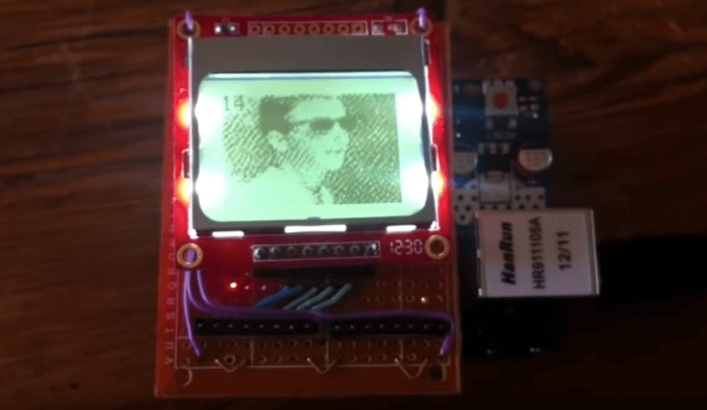

# Arduino Nokia 3310 video player

An Arduino sketch that plays videos from an SD card on a Nokia 3310 (or 5110) monochrome LCD display.

A menu interface allows video file selection using capacitive buttons for operation. Frame rates achieved are around 15fps!

## [View demo (YouTube)](https://www.youtube.com/watch?v=FJBNF5x1_kA)

## Dependencies

* [Adafruit Nokia 3110/5110 LCD Arduino library](https://learn.adafruit.com/nokia-5110-3310-monochrome-lcd)

## Usage

Please read the [full writeup](https://joeraut.com/blog/playing-video-nokia-3310/) on how to get things working, including generating videos to be played back.

See the [Processing sketches for video generation](https://github.com/joeraut/processing-nokia3310-video-converter).

## License

This project is licensed under the MIT License - see the [LICENSE](LICENSE) file for details.
